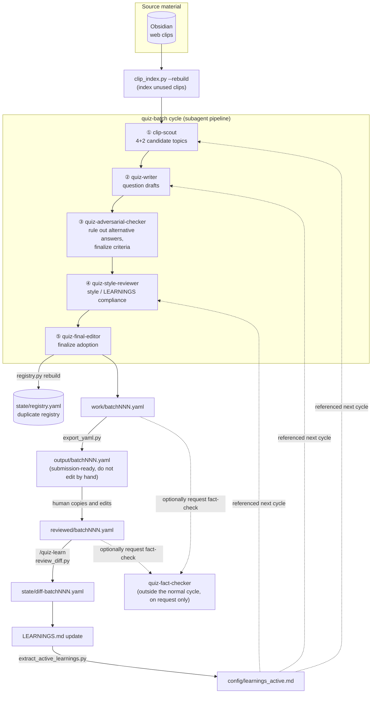
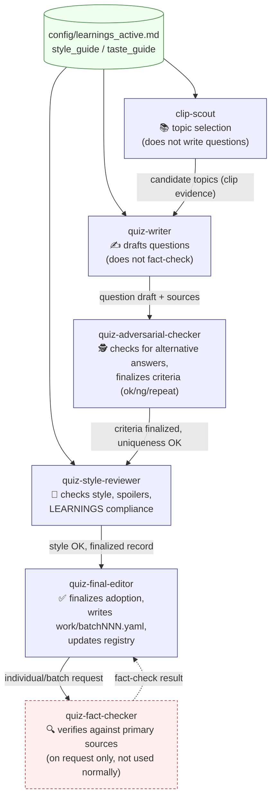
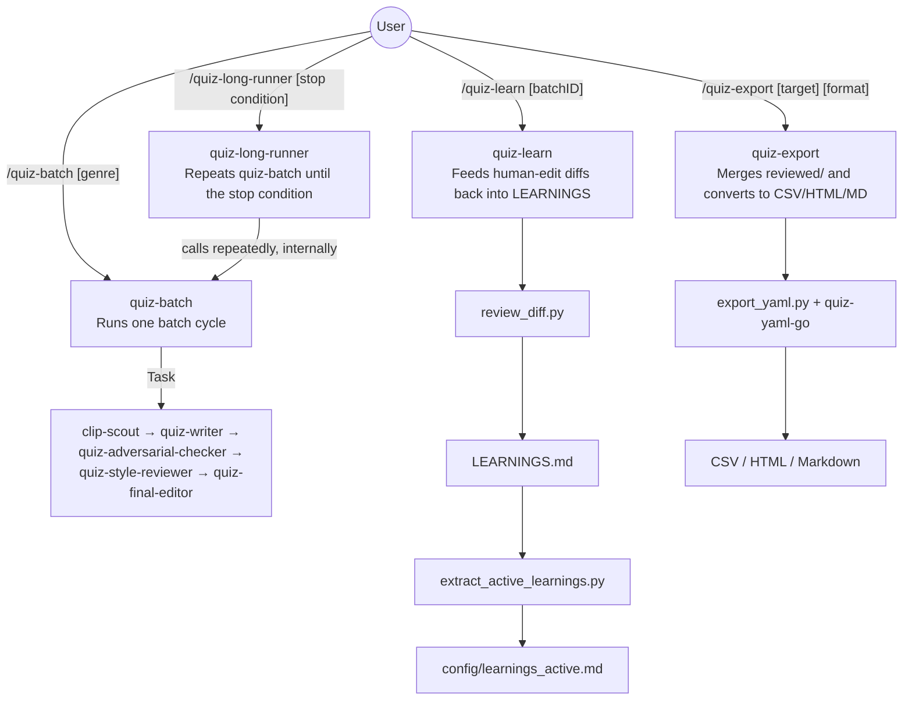
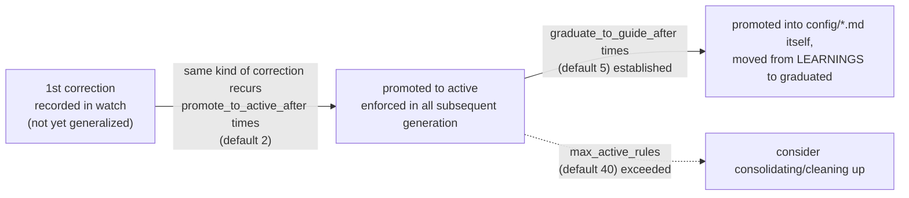

# Repository Architecture

This document summarizes the directory layout, processing flow, and the division of
responsibilities between Claude Code Skills / Subagents for the `quiz-generator`
(automated Japanese quiz-writing) project. The project's policy itself is authoritative
in [`CLAUDE.md`](../CLAUDE.md), and operational details are authoritative in
[`README.md`](../README.md). This document is a supplementary resource meant to make it
easier to see both at a glance.

## 1. What this repository does

Using web clips accumulated in Obsidian as the primary source material, this repository
generates Japanese one-question-one-answer quizzes through a five-stage subagent
pipeline:

1. Topic selection → 2. Question writing → 3. Alternative-answer verification →
4. Style review → 5. Adoption decision

The results are then finalized through human review, and the corrections made during
that review are fed back into `LEARNINGS.md`, driving a self-improving loop that raises
generation quality over time. This is a working repository built around that loop.
Fact-checking (verifying claims against primary sources) is *not* part of the normal
cycle — it is only performed by `quiz-fact-checker`, either during human review or when
explicitly requested.

## 2. Directory structure

```
quiz-generator/
├── CLAUDE.md                     # Project-wide policy (read with highest priority)
├── README.md                     # Setup and usage
├── LEARNINGS.md                  # Rules extracted from human corrections (source of truth)
├── past_questions.yaml           # Past questions (used for duplicate-detection)
│
├── .claude/
│   ├── agents/*.md                # Definitions for the 6 subagents
│   └── skills/*/SKILL.md          # Bodies of slash commands such as /quiz-batch
│
├── config/
│   ├── settings.yaml               # Paths, limits, thresholds
│   ├── learnings_active.md         # Active-section excerpt of LEARNINGS.md (auto-generated, do not edit)
│   ├── quiz_question_style_guide.md  # Question format / writing style policy
│   ├── quiz_notation_rules.md        # Notation rules for the answer/spell/criteria fields
│   ├── quiz_topic_taste_guide.md     # Preferences for topic selection
│   ├── quiz_topic_framing_guide.md   # Angle patterns / how to combine information
│   ├── genre_targets.yaml            # Genre-distribution targets
│   └── past_questions_analysis.md
│
├── scripts/
│   ├── *.py                        # CLI entry points (typer). Indexing, duplicate detection,
│   │                                #   schema conversion, diff extraction
│   └── quiz_generator/*.py         # Shared logic imported by the above (common.py, etc.)
│
├── work/batchNNN.yaml              # Working files (incl. sources, verification logs, adoption status).
│                                    #   Written by the agents.
├── output/batchNNN.yaml            # Submission-ready files. Conform to the quiz-yaml-go schema.
│                                    #   Do not edit by hand.
├── reviewed/batchNNN.yaml          # Human-edited version, copied from output/
├── archive/                        # Finalized question sets
├── state/                          # Clip index, duplicate registry, diffs. Managed by scripts.
└── examples/                       # Sample files for each file format
```

| Path | Role | Written by |
| --- | --- | --- |
| `work/batchNNN.yaml` | Working file with metadata (sources, verification logs, adoption status) | `quiz-final-editor` |
| `output/batchNNN.yaml` | Submission-ready YAML conforming to the quiz-yaml-go schema | `scripts/export_yaml.py` (auto-generated) |
| `reviewed/batchNNN.yaml` | Human-edited version | Human |
| `state/*.yaml` | Clip index, duplicate registry, diffs | `scripts/*.py` (auto-generated) |
| `archive/` | Finalized question sets | Human / scripts |
| `config/learnings_active.md` | Excerpt of the active section of `LEARNINGS.md` | `scripts/extract_active_learnings.py` (auto-generated) |

## 3. Full flow of one cycle

From fetching clips through feeding results back into `LEARNINGS.md`, one cycle looks
like this:



**Key points**

- The normal cycle (`/quiz-batch`) is completed by the five agents ①–⑤ only;
  `quiz-fact-checker` is not included. Verifying claims against primary sources is
  intentionally omitted from the normal cycle, and only runs during human review or on
  individual request.
- Both `output/` and `config/learnings_active.md` are auto-generated artifacts and must
  never be edited by hand (regenerate them by editing the underlying `work/` files or
  `LEARNINGS.md` instead).
- Duplicate detection, schema conversion, and diff extraction are never left to LLM
  judgment — they are all handled mechanically by `scripts/*.py`, to avoid mistakes from
  an LLM guessing "this is probably not a duplicate."

## 4. Division of responsibilities among subagents

Each subagent (`.claude/agents/*.md`) has a clearly separated area of responsibility,
trusting the results of the previous step and focusing only on its own concern.



| Agent | What it looks at | What it leaves to other stages |
| --- | --- | --- |
| `clip-scout` | Whether a topic from an unused clip is promising, and not already covered | The question text itself |
| `quiz-writer` | Assembling a question that works as one-question-one-answer | Factual accuracy, alternative answers |
| `quiz-adversarial-checker` | Whether the answer is uniquely determined (ruling out alternatives) | Factual correctness itself (flags it if noticed, but doesn't own it) |
| `quiz-style-reviewer` | Style, word order, length, spoilers, LEARNINGS compliance | Facts and uniqueness (assumed guaranteed by earlier stages) |
| `quiz-final-editor` | Adoption decision synthesizing all review results | The reasoning behind each individual review (not passed through in full) |
| `quiz-fact-checker` | Verifying facts against primary sources | Never takes a clip's description at face value |

## 5. Relationship between Skills (slash commands) and agents

`.claude/skills/*/SKILL.md` are the user-facing commands; internally they use the `Task`
tool to invoke the subagents above in sequence.



| Skill | Role | Implementation |
| --- | --- | --- |
| `/quiz-batch` | Runs one batch (default 4 questions) of the question-writing cycle | `.claude/skills/quiz-batch/SKILL.md` |
| `/quiz-long-runner` | Runs `quiz-batch` repeatedly until a given end time or batch count | `.claude/skills/quiz-long-runner/SKILL.md` |
| `/quiz-learn` | Reads human-edit diffs and updates `LEARNINGS.md` | `.claude/skills/quiz-learn/SKILL.md` |
| `/quiz-export` | Merges `reviewed/` and converts via quiz-yaml-go | `.claude/skills/quiz-export/SKILL.md` |

## 6. How LEARNINGS grows

The more a human correction appears as a recurring pattern, the more strongly the
resulting rule gets enforced (thresholds live in the `learnings` section of
`config/settings.yaml`).



## 7. Script list

All scripts run via `uv run scripts/xxx.py` (typer-based CLI, requires PyYAML). They
handle mechanical processing (duplicate detection, schema conversion, diff extraction)
that would be error-prone if left to an LLM, and never make the judgment calls
themselves. Dependencies are managed both via `pyproject.toml` (`uv sync` sets up a
local environment) and via PEP 723 inline metadata at the top of each script.

| Script | Role |
| --- | --- |
| `clip_index.py` | Index Obsidian clips; list unused clips |
| `registry.py` | Rebuild the duplicate registry, check for duplicates, compute genre-distribution stats |
| `export_yaml.py` | Convert `work/batchNNN.yaml` → quiz-yaml-go schema-compliant `output/` |
| `review_diff.py` | Produce a structured diff between `output/` and `reviewed/` |
| `extract_active_learnings.py` | Extract only the active section of `LEARNINGS.md` into `config/learnings_active.md` |
| `quiz_generator/common.py` | Shared helpers used by all scripts: path resolution, YAML I/O, config loading |
| `quiz_generator/learnings.py` | Parsing/extraction logic for `LEARNINGS.md`, used by `extract_active_learnings.py` |
| `quiz_generator/clip_index.py` / `registry.py` / `export_yaml.py` / `review_diff.py` | Core logic invoked by the like-named CLI scripts (CLI layer separated from logic layer) |

## 8. Key priorities and prohibitions

See [`CLAUDE.md`](../CLAUDE.md) for full details. Only the points relevant to
understanding the overall architecture are noted here.

- Rule priority order: `LEARNINGS.md` > `quiz_question_style_guide.md` /
  `quiz_notation_rules.md` > `quiz_topic_taste_guide.md` / `quiz_topic_framing_guide.md`
  (within `LEARNINGS.md`, newer rules take precedence).
- `output/` and `config/learnings_active.md` are auto-generated artifacts; never edit
  them directly.
- `state/registry.yaml` must always be updated via scripts; an LLM must never rewrite it
  directly.
- In the normal cycle, do not explore the web aimlessly — stop once clips run out.
