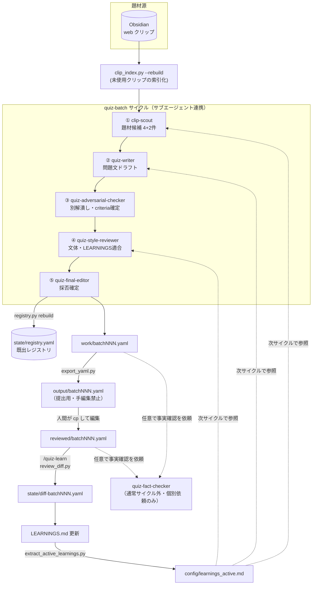
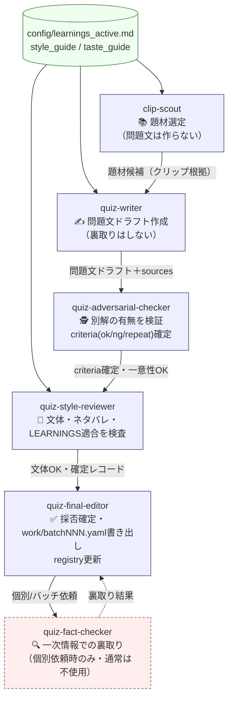
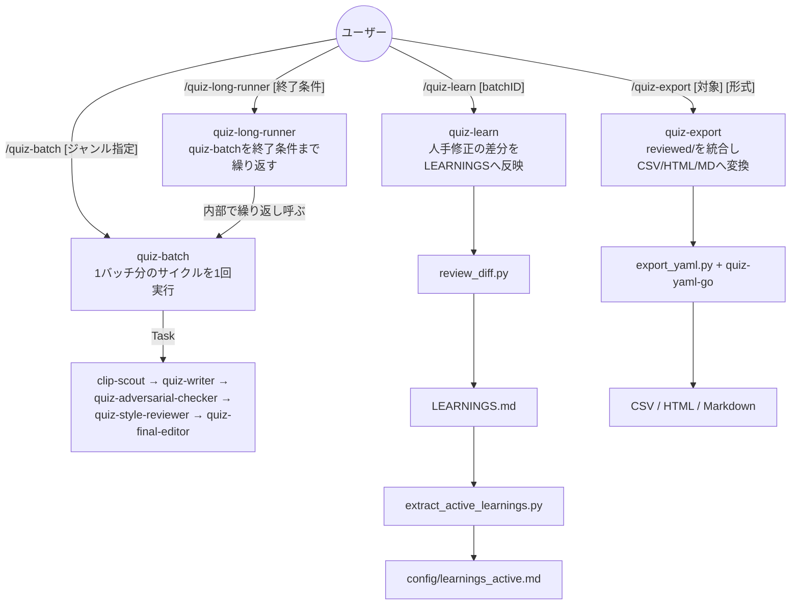
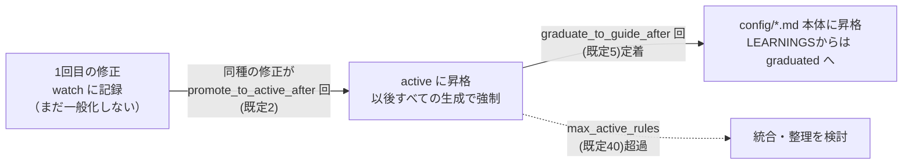

# リポジトリ全体構造

このドキュメントは、`quiz-generator`（クイズ自動作問プロジェクト）のディレクトリ構成・処理フロー・
Claude Code の Skills / Subagents の役割分担をまとめたものです。プロジェクトの方針そのものは
[`CLAUDE.md`](../CLAUDE.md) が正、運用の詳細は [`README.md`](../README.md) が正です。このドキュメントは
両者を俯瞰しやすくするための補助資料です。

## 1. このリポジトリがやっていること

Obsidian に溜めた web クリップを一次的な題材源として、日本語の 1問1答クイズを

1. 題材選定 → 2. 作問 → 3. 別解検証 → 4. 文体確認 → 5. 採否確定

という 5 段階のサブエージェント連携で生成し、人間のレビューで確定させ、その修正内容を
`LEARNINGS.md` に還流して次回以降の生成品質を上げていく、という自己改善ループを回すための
作業用リポジトリです。事実確認（裏取り）は通常サイクルには含まれず、人間のレビュー時か、
個別依頼時にのみ `quiz-fact-checker` が担当します。

## 2. ディレクトリ構成

```
quiz-generator/
├── CLAUDE.md                     # プロジェクト全体の方針（最優先で読まれる）
├── README.md                     # セットアップ・使い方
├── LEARNINGS.md                  # 人手修正から抽出したルール（source of truth）
├── past_questions.yaml           # 過去問（既出判定の対象）
│
├── .claude/
│   ├── agents/*.md                # 6体のサブエージェント定義
│   └── skills/*/SKILL.md          # /quiz-batch 等のスラッシュコマンド本体
│
├── config/
│   ├── settings.yaml               # パス・上限値・しきい値
│   ├── learnings_active.md         # LEARNINGS.md の active 抜粋（自動生成・編集禁止）
│   ├── quiz_question_style_guide.md  # 問題文の形式・文体方針
│   ├── quiz_topic_taste_guide.md     # 題材・切り口の好み
│   ├── genre_targets.yaml            # ジャンル配分の目標
│   └── past_questions_analysis.md
│
├── scripts/*.py                    # 索引化・重複判定・変換・差分抽出（LLMに任せない処理）
│
├── work/batchNNN.yaml              # 作業用（出典・検証ログ・採否込み）。エージェントが書く
├── output/batchNNN.yaml            # 提出用。quiz-yaml-go スキーマ準拠。手で編集しない
├── reviewed/batchNNN.yaml          # 人間が output/ をコピーして修正した版
├── archive/                        # 確定済みの問題群
├── state/                          # クリップ索引・既出レジストリ・差分。スクリプトが管理
└── examples/                       # 各ファイル形式のサンプル
```

| パス | 役割 | 誰が書くか |
| --- | --- | --- |
| `work/batchNNN.yaml` | メタ情報（出典・検証ログ・採否）込みの作業ファイル | `quiz-final-editor` |
| `output/batchNNN.yaml` | quiz-yaml-go スキーマ準拠の提出用 YAML | `scripts/export_yaml.py`（自動生成） |
| `reviewed/batchNNN.yaml` | 人間が修正した版 | 人間 |
| `state/*.yaml` | クリップ索引・既出レジストリ・差分 | `scripts/*.py`（自動生成） |
| `archive/` | 確定済みの問題群 | 人間 / スクリプト |
| `config/learnings_active.md` | `LEARNINGS.md` の active セクション抜粋 | `scripts/extract_active_learnings.py`（自動生成） |

## 3. 1サイクルの全体フロー

クリップの取得から `LEARNINGS.md` への還流までを1周とすると、以下のようになります。



**ポイント**

- 通常サイクル（`/quiz-batch`）は①〜⑤の5エージェントのみで完結し、`quiz-fact-checker` は含まれません。
  一次情報の裏取りは意図的に省略し、人間のレビュー時か個別依頼時にのみ実行します。
- `output/` と `config/learnings_active.md` はどちらも自動生成物であり、手で編集してはいけません
  （元になる `work/` や `LEARNINGS.md` を直して再生成します）。
- 既出判定・スキーマ変換・差分抽出は LLM に判断させず、すべて `scripts/*.py` が機械的に行います
  （LLM の「たぶん既出じゃない」判断による事故を避けるため）。

## 4. サブエージェントの役割分担

各サブエージェント（`.claude/agents/*.md`）は担当領域が明確に分離されており、前工程の結果を
信頼して自分の観点だけに集中します。



| エージェント | 見ている観点 | 見ていない観点（前後工程に委ねる） |
| --- | --- | --- |
| `clip-scout` | 未使用クリップからの題材の筋の良さ、既出でないか | 問題文そのもの |
| `quiz-writer` | 1問1答として成立する問題文の組み立て | 事実の正確性、別解の有無 |
| `quiz-adversarial-checker` | 答えが一意に定まるか（別解潰し） | 事実の正誤そのもの（気付いたら指摘はする） |
| `quiz-style-reviewer` | 文体・語順・長さ・ネタバレ・LEARNINGS適合 | 事実と一意性（前工程が担保済み前提） |
| `quiz-final-editor` | 全レビュー結果を突き合わせた採否判定 | 各レビューの検討過程そのもの（間引かれて渡らない） |
| `quiz-fact-checker` | 一次情報による事実の裏取り | クリップの記述はそのまま採用しない |

## 5. Skills（スラッシュコマンド）とエージェントの関係

`.claude/skills/*/SKILL.md` がユーザー向けのコマンドで、内部で `Task` ツールを使い上記の
サブエージェントを順番に呼び出します。



| Skill | 役割 | 実体 |
| --- | --- | --- |
| `/quiz-batch` | 1バッチ（既定4問）の作問サイクルを1回まわす | `.claude/skills/quiz-batch/SKILL.md` |
| `/quiz-long-runner` | 終了時刻／バッチ数を指定して `quiz-batch` を連続実行 | `.claude/skills/quiz-long-runner/SKILL.md` |
| `/quiz-learn` | 人手修正の差分を読み `LEARNINGS.md` を更新 | `.claude/skills/quiz-learn/SKILL.md` |
| `/quiz-export` | `reviewed/` を統合し quiz-yaml-go で変換 | `.claude/skills/quiz-export/SKILL.md` |

## 6. LEARNINGS の育ち方

人手修正が繰り返しの傾向として現れるほど、ルールの強制力が上がっていきます
（しきい値は `config/settings.yaml` の `learnings` セクション）。



## 7. スクリプト一覧

すべて `uv run scripts/xxx.py`（PyYAML 必須）で実行します。LLM に任せると事故りやすい
機械的処理（重複判定・スキーマ変換・差分抽出）を担当し、判断そのものはさせません。

| スクリプト | 役割 |
| --- | --- |
| `clip_index.py` | Obsidian クリップの索引化・未使用クリップの列挙 |
| `registry.py` | 既出レジストリの再構築・既出判定・ジャンル配分の統計 |
| `export_yaml.py` | `work/batchNNN.yaml` → quiz-yaml-go スキーマ準拠の `output/` へ変換 |
| `review_diff.py` | `output/` と `reviewed/` の差分を構造化して出力 |
| `extract_active_learnings.py` | `LEARNINGS.md` の active セクションだけを `config/learnings_active.md` に抽出 |
| `quizlib.py` | 各スクリプトから import される共通ヘルパ |

## 8. 優先順位・禁止事項の要点

詳細は [`CLAUDE.md`](../CLAUDE.md) を参照してください。ここでは全体構造の理解に関わる要点のみ記します。

- ルールの優先順位: `LEARNINGS.md` > `quiz_question_style_guide.md` > `quiz_topic_taste_guide.md`
  （`LEARNINGS.md` 内では新しいルールほど優先）。
- `output/` と `config/learnings_active.md` は自動生成物であり、直接編集しない。
- `state/registry.yaml` は必ずスクリプト経由で更新し、LLM が直接書き換えない。
- 通常サイクルでは web を無目的に探索せず、クリップが尽きたら停止する。
